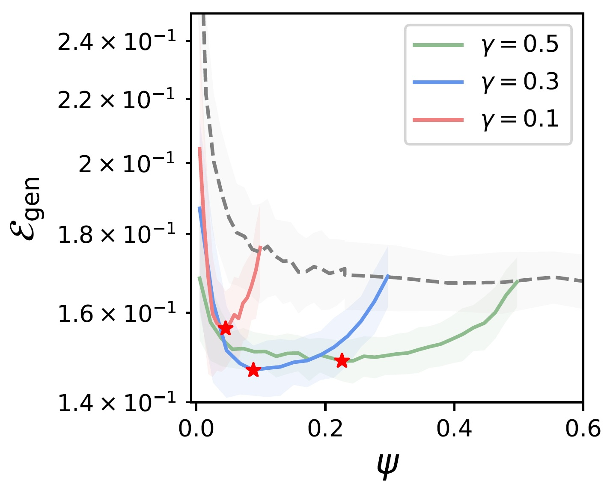

#Asymptotic theory of iterated ERMs, with applications to Active Learning

Code for the paper : <i>Asymptotic Theory of iterated Empirical Risk Minimizations, with Applications to Active Learning</i> 
<p align="center"></center></p>

- <tt>real_data_clean</tt> contains the code for the real data experiment, for the task of pneumonia diagnosis on chest X-ray scans [1]. The dataset was preprocessed using 
```
transform = transforms.Compose([transforms.Resize((40, 40)),transforms.ToTensor()])
train_dataset = datasets.ImageFolder("pneumonia_dataset/chest_xray/train",transform=transform)
test_dataset = datasets.ImageFolder("pneumonia_dataset/chest_xray/test",transform=transform)
```
then averaged over the first (channel) axis. The images were then fed to a scattering transform with $J=4, L=6$ [2]. A first base classifier is trained with logistic loss on $n_\psi$ samples from the training set, then used to select the $n_\gamma -n_\psi$ remaining samples with smallest predicted margin, where $n_\gamma$ is the total budget. A final classifier is then trained on the selected subset. Before each training, the datasets are balanced by up- (resp. down-) sampling the minority (resp. majority) class.

[1] Daniel S Kermany, Michael Goldbaum, Wenjia Cai, Carolina CS Valentim, Huiying Liang, Sally L Baxter, Alex McKeown, Ge Yang, Xiaokang Wu, Fangbing Yan, et al. <i>Identifying medical diagnoses and treatable diseases by image-based deep learning</i>. cell, 172(5):1122–1131, 2018.

[2] Mathieu Andreux, Tomás Angles, Georgios Exarchakis, Roberto Leonarduzzi, Gaspar Rochette, Louis Thiry, John Zarka, Stéphane Mallat, Joakim Andén, Eugene Belilovsky, et al. <i>Kymatio: Scattering transforms in python</i>. Journal of Machine Learning Research, 21(60):1–6, 2020.

<u> Versions:</u> These notebooks employ <tt>Python 3.12 </tt>.
